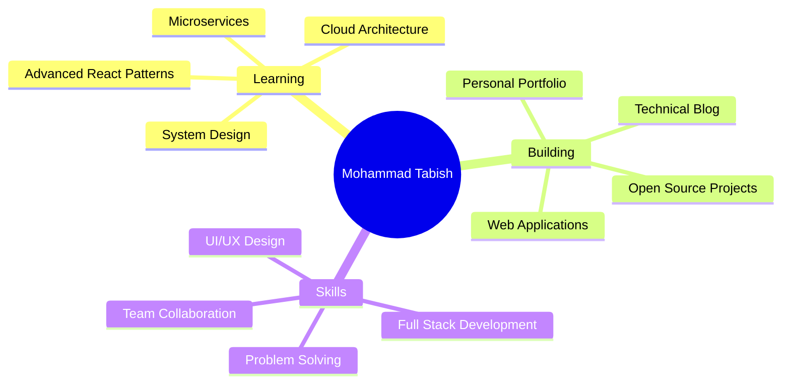

<div align="center">


</div>

<div align="center">
  
[](https://git.io/typing-svg)

</div>

<br>

<div align="center">

[](https://linkedin.com/in/Mohammad%20Tabish%20Ansari)
[](https://github.com/MdTabish24)
[](https://instagram.com/md.tabish_ansari)
[](https://x.com/Ansari_MdTabish)
[](https://behance.net/MdTabish)

</div>

<br>

## 🎯 About Me

```typescript
const developer = {
  name: "Mohammad Tabish Ansari",
  location: "Bhiwandi, Maharashtra, India 🇮🇳",
  education: "BSc IT @ BK Birla College (Autonomous), Kalyan",
  currentYear: "Second Year",
  
  expertise: {
    frontend: ["JavaScript", "Bootstrap", "Tailwind CSS", "Responsive Design"],
    backend: ["Java", "Spring Boot", "Hibernate", "RESTful APIs"],
    database: ["MongoDB", "SQL"],
    design: ["Figma", "Canva", "UI/UX"],
    tools: ["Git", "VS Code", "Postman", "Linux"]
  },
  
  currentFocus: [
    "Advanced React Patterns",
    "System Design & Architecture", 
    "Cloud Technologies",
    "Open Source Contributions"
  ],
  
  interests: ["Web Development", "Problem Solving", "UI/UX Design", "DSA"],
  
  availableFor: {
    internships: true,
    freelance: true,
    collaboration: true,
    mentorship: true
  }
};
```

<br>

## 💻 Tech Stack

<div align="center">

### Languages & Core


### Frameworks & Libraries


### Databases & Tools


### Design & Productivity


</div>

<br>

## 📊 GitHub Analytics

<div align="center">
  


</div>

<br>

## 🎓 Education & Achievements

<table align="center">
<tr>
<td align="center" width="50%">

<br><br>
<strong>BK Birla College (Autonomous)</strong>
<br>
Bachelor of Science - Information Technology
<br>
📅 2023 - 2026 (Expected)
<br>
📍 Kalyan, Maharashtra
</td>
<td align="center" width="50%">

<br><br>
<strong>Key Coursework</strong>
<br>
• Web Technologies
<br>
• Database Management Systems
<br>
• Data Structures & Algorithms
<br>
• Software Engineering
</td>
</tr>
</table>

<br>

## 🚀 Current Focus

<div align="center">



</div>

<br>

## 🏆 GitHub Trophies

<div align="center">

[](https://github.com/ryo-ma/github-profile-trophy)

</div>

<br>

## 📫 Let's Connect

<div align="center">

### 💬 Open for Opportunities

I'm actively seeking **internships**, **freelance projects**, and **collaborative opportunities**. Whether you have a project idea, need technical guidance, or just want to discuss tech, I'm here!

<br>

**📧 Email:** your.email@example.com  
**💼 LinkedIn:** [Mohammad Tabish Ansari](https://linkedin.com/in/Mohammad%20Tabish%20Ansari)  
**🌐 Portfolio:** [github.com/MdTabish24](https://github.com/MdTabish24)

<br>

[](https://visitcount.itsvg.in)

</div>

<br>

---

<div align="center">

### ⚡ "Code with passion, design with purpose, build with excellence."


</div>
